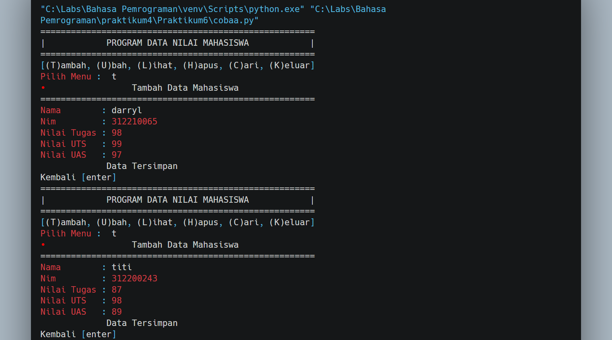

# Praktikum
## Praktikum 6
## Tugas Praktikum

## Buat program sederhana dengan mengaplikasikan penggunaan fungsi
## yang akan menampilkan daftar nilai mahasiswa, dengan ketentuan:
### • Fungsi tambah() untuk menambah data
### • Fungsi tapilkan() untuk menampilkan data
### • Fungsi hapus(nama) untuk menghapus data berdasarkan nama
### • Fungsi ubah(nama) untuk mengubah data berdasarkan nama

### Program

### Hasil

